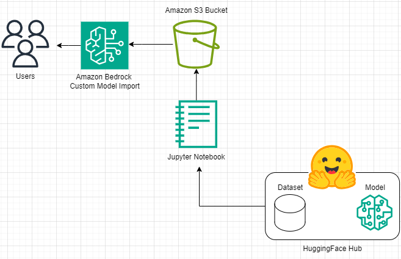

# Fine tuning & deploying Flan-T5-Large to Amazon Bedrock using Custom Model Import (Using PEFT & SFTTrainer)

## Overview

this notebook was tested on a ["g5.12xlarge"](https://aws.amazon.com/ec2/instance-types/g5/) instance. 

This notebook will use the HuggingFace Transformers library to fine tune FLAN-T5-Large. due to the fine tuning process being "local" you can run this notebook anywhere as long as the proper compute is available. 

1. Configuring an AWS EC2 instance with a Deep Learning AMI, and setting up a Jupyter Server: [Link](https://docs.aws.amazon.com/dlami/latest/devguide/launch-config.html)
2. Configuring an Amazon Sagemaker environment: [Link](https://docs.aws.amazon.com/sagemaker/latest/dg/gs.html)
3. Configure your own environment, with equivalent compute

This notebook covers the step by step process of fine tuning a [FLAN-T5 large](https://huggingface.co/google/flan-t5-large) mode and deploying it using Bedrock's [Custom Model Import](https://docs.aws.amazon.com/bedrock/latest/userguide/model-customization-import-model.html) feature. 
The fine tuning data we will be using is based on medical terminology this data can be found on HuggingFace [here](https://huggingface.co/datasets/gamino/wiki_medical_terms). In many discplines, industry specific jargon is used and an LLM may not have the correct understanding of words, context or abbreviations. By fine tuning a model on medical terminology in this case, the LLM is given the ability to understand specific jargon and answer questions the user might have. 

## Amazon Bedrock Custom Model Import (CMI)

The resulting model files are imported into Amazon Bedrock via [Custom Model Import (CMI)](https://docs.aws.amazon.com/bedrock/latest/userguide/model-customization-import-model.html). 

Bedrock Custom Model Import allows for importing foundation models that have been customized in other environments outside of Amazon Bedrock, such as Amazon Sagemaker, EC2, etc. 

WARNING: This method of Custom Model Import will only work with "FLAN-t5-large". "FLAN-t5-small" is incompatible with Bedrock Custom Model Import in its current state. This is due to the number of heads in the model needing to be a multiple of 4, due to the model needing to be sharded accordingly in the GPU. the number of heads for FLAN-t5-small is 6. this can be checked in the model's config.json file under the parameter "num_heads" 

## Use Case 

Often times the broad knowledge of Foundation Models allows for usage in multiple use cases. In some workflows, where domain specific jargon is required, out of the box foundation models may not be sufficient in recognizing or defining terms. In this example the model will be finetuned on Medical Terminology, to be able to recognize & define medical domain specific terms. A customized model such as this can be useful for patients who may receive a diagnosis and need it broken down in simpler, everyday terms. This type of customized model could even help medical students while they study.    

## What will you learn from this notebook

In this notebook, you will learn how to:

* Pull a model from the HuggingFace Hub & quantize it
* Pull a dataset from HuggingFace & Process it 
* Finetune the model (Flan-T5)
* Deploy the finetuned model to Amazon Bedrock Custom Import & Conduct Inference

## Architectural pattern 

As can be seen from the diagram above, the dataset & model (Flan-T5) get pulled from the HuggingFace hub, and are finetuned on a Jupyter Notebook. The model files are then stored in an S3 bucket, to then be imported into Amazon Bedrock. This architecture is modular because the Notebook can be run anywhere, that the appropriate compute is available (as explained earlier).

## Flan-T5

Flan-T5 is the model we will be finetuning in this notebook. Flan-T5 is an efficient smaller model that is easy to use, and easy to deploy with Bedrock Custom Model Import. It is a Sequence to Sequence (Seq2Seq) model which uses an encoder-decoder architecture. What this means is this model processes in two parts - processes inputs with the encoder, and processes outputs with the decoder. This two part process allows models like Flan-T5 to be efficient in tasks like summarization, translation, and Q & A.    

## Now open "flant5-finetune-medical-terms.ipynb" to get started! 
