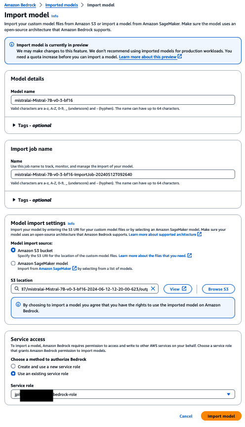
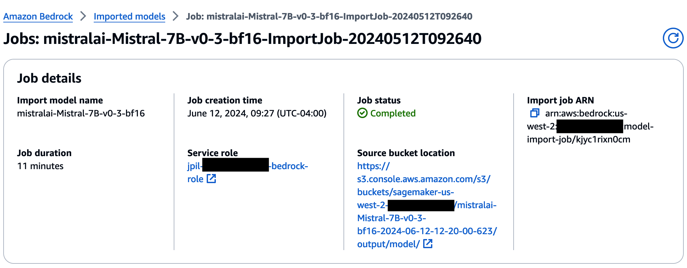
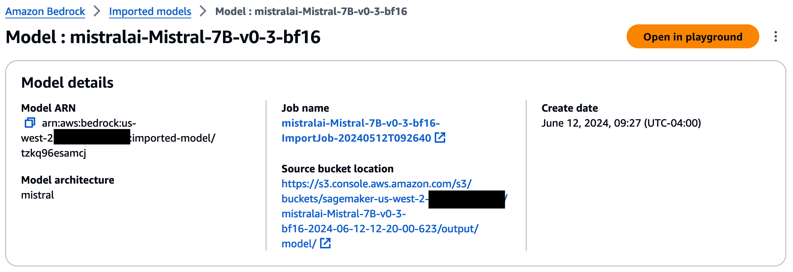
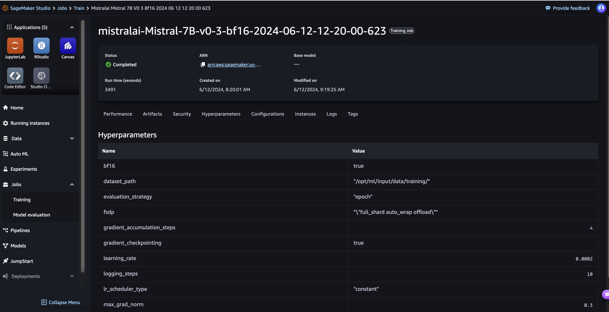

<h1> Fine-Tuning Mistral LLM and importing into Bedrock: A Step-by-Step Instructional Guide </h1>

In this notebook we will walk through how to fine-tune a Mistral LLM for Question Answering on Amazon SageMaker using PyTorch FSDP and Flash Attention 2 including Q-LORA and PEFT. This notebook also explains using PEFT and merging the adapters. 

We will quantize the model as bf16 model. We use [Supervised Fine-tuning Trainer](https://huggingface.co/docs/trl/sft_trainer) (SFT) for fine tuning the model. We will use [Open-Orca/OpenOrca] (https://huggingface.co/datasets/Open-Orca/OpenOrca) dataset for fine tuning the model. This is a reading comprehension dataset containing over 650K question-answer-evidence triples. 

Using [FSDP](https://pytorch.org/docs/main/fsdp.html) and [Q-Lora](https://arxiv.org/abs/2305.14314) allows us to fine tune Mistral models on 2x consumer GPU's. FSDP enables sharding model parameters, optimizer states and gradients across data parallel workers. Q- LORA helps reduce the memmory usage for finetuning LLM while preserving full 16-bit task performance. For fine tuning in this notebook we use ml.g5.12xlarge as a SageMaker Training Job. 

[Amazon SageMaker](https://aws.amazon.com/sagemaker) provides a fully managed service that enables build, train and deploy ML models at scale using tools like notebooks, debuggers, profilers, pipelines, MLOps, and more – all in one integrated development environment (IDE). [SageMaker Model Training](https://aws.amazon.com/sagemaker/train/) reduces the time and cost to train and tune machine learning (ML) models at scale without the need to manage infrastructure.

For detailed instructions please refer to [Importing a model with customer model import Bedrock Documentation](https://docs.aws.amazon.com/bedrock/latest/userguide/model-customization-import-model.html).

This notebook is inspired by Philipp Schmid Blog - https://www.philschmid.de/fsdp-qlora-llama3

<h2> Model License information </h2>

In this notebook we use the Mistral-7B-v0.3 model from HuggingFace repository. This model is a gated model within HuggingFace repository. Mistral released this model under the Apache 2.0 license (https://mistral.ai/news/announcing-mistral-7b/). To use the model from Huggingface as this model is a gated model you have to request access to the model before it using in this notebook.

<h2>Notebook code and comments </h2>

<h3> Install the Pre-Requisites </h3>

```python
!pip3 uninstall autogluon autogluon-multimodal -y
!pip3 install transformers "sagemaker>=2.190.0" "huggingface_hub" "datasets[s3]==2.18.0" --upgrade --quiet
!pip3 install boto3 s3fs "aiobotocore==2.11.0" --upgrade --quiet
```

Logging into the HuggingFace Hub and requesting access to the mistralai/Mistral-7B-v0.3 is required to download the model and finetune the same. Please follow the [HuggingFace User Token Documentation](https://huggingface.co/docs/hub/en/security-tokens) to request tokens to be provided in the textbox appearning below after you run the cell.


```python
from huggingface_hub import notebook_login
notebook_login()
```

<h3> Setup </h3>
We will initialize the SageMaker Session required to finetune the model.


```python
import sagemaker
import boto3
sess = sagemaker.Session()
# sagemaker session bucket -> used for uploading data, models and logs
# sagemaker will automatically create this bucket if it not exists
sagemaker_session_bucket=None
if sagemaker_session_bucket is None and sess is not None:
    # set to default bucket if a bucket name is not given
    sagemaker_session_bucket = sess.default_bucket()
 
try:
    role = sagemaker.get_execution_role()
except ValueError:
    iam = boto3.client('iam')
    role = iam.get_role(RoleName='sagemaker_execution_role')['Role']['Arn']
 
sess = sagemaker.Session(default_bucket=sagemaker_session_bucket)
 
print(f"sagemaker role arn: {role}")
print(f"sagemaker bucket: {sess.default_bucket()}")
print(f"sagemaker session region: {sess.boto_region_name}")
```

<h3> Define the Parameters </h3>

```python
model_id = "mistralai/Mistral-7B-v0.3"
# save train_dataset to s3 using our SageMaker session
training_input_path = f's3://{sess.default_bucket()}/datasets/trivia_qa'
use_bf16 = True
```

<h3> Dataset Prepare </h3>
We will use [Open-Orca/OpenOrca](https://huggingface.co/datasets/Open-Orca/OpenOrca) dataset to finetune the Mistral 7B model. Kindly refer to the [Licensing Information](https://huggingface.co/datasets/Open-Orca/OpenOrca/tree/main#licensing-information) regarding this dataset before proceeding further.

We will transform the messages to OAI format and split the data into Train and Test set. The Train and Test dataset will be uploaded into S3 - SageMaker Session Bucket for use during finetuning.


```python
from datasets import load_dataset

def create_conversation(row):
    row["messages"] = [
            {
                "role": "system",
                "content": row["system_prompt"],
            },        
            {
                "role": "user",
                "content": row["question"],
            },
            {
                "role": "assistant",
                "content": row["response"]
            },
    ]
    return row

# Load dataset from the hub
dataset = load_dataset("Open-Orca/OpenOrca")
flan_dataset = dataset.filter(lambda example, indice: "flan" in example["id"], with_indices=True)
flan_dataset = flan_dataset["train"].train_test_split(test_size=0.01, train_size=0.035)

columns_to_remove = list(dataset["train"].features)
flan_dataset = flan_dataset.map(create_conversation, remove_columns=columns_to_remove, batched=False)

# save datasets to s3
flan_dataset["train"].to_json(f"{training_input_path}/train_dataset.json", orient="records", force_ascii=False)
flan_dataset["test"].to_json(f"{training_input_path}/test_dataset.json", orient="records", force_ascii=False)
 
print(f"Training data uploaded to:")
print(f"{training_input_path}/train_dataset.json")
print(f"https://s3.console.aws.amazon.com/s3/buckets/{sess.default_bucket()}/?region={sess.boto_region_name}&prefix={training_input_path.split('/', 3)[-1]}/")
```


```python
print(f'Training Row Count - {len(flan_dataset["train"])}')
print(f'Validation/Test Row Count - {len(flan_dataset["test"])}')
```

<h3> Training script and dependencies </h3>

Create the scripts directory to hold the training script and dependencies list. This directory will be provided to the trainer.


```python
import os
os.makedirs("scripts/trl/mistral-qna", exist_ok=True)
```

Create the requirements file that will be used by the SageMaker Job container to initialize the dependencies.


```python
%%writefile scripts/trl/mistral-qna/requirements.txt
torch==2.2.2
transformers==4.40.2
sagemaker>=2.190.0
datasets==2.18.0
accelerate==0.29.3
evaluate==0.4.1
bitsandbytes==0.43.1
trl==0.8.6
peft==0.10.0
```

Training Script that will use PyTorch FSDP, QLORA, PEFT and train the model using SFT Trainer. This script also includes prepping the data to Mistral 7B chat template (Anthropic/Vicuna format). This training script is being written to the scripts folder along with the requirements file that will be used by the SageMaker Job.


```python
%%writefile scripts/trl/mistral-qna/run_fsdp_qlora.py
import logging
from dataclasses import dataclass, field
import os

try:
    os.system("pip install flash-attn --no-build-isolation --upgrade")
except:
    print("flash-attn failed to install")

import random
import torch
from datasets import load_dataset, Dataset
from tqdm import tqdm
from trl.commands.cli_utils import  TrlParser
from transformers import (
    AutoModelForCausalLM,
    AutoTokenizer,
    TrainingArguments,
    HfArgumentParser,
    BitsAndBytesConfig,
        set_seed,

)
from trl import setup_chat_format
from peft import LoraConfig


from trl import (SFTTrainer)

MISTRAL_CHAT_TEMPLATE = (
    ""
        ""
            "{{ message['content'] }}"
        ""
            "{{ '\n\nHuman: ' + message['content'] +  eos_token }}"
        ""
            "{{ '\n\nAssistant: '  + message['content'] +  eos_token  }}"
        ""
    ""
    ""
    "{{ '\n\nAssistant: ' }}"
    ""
)


tqdm.pandas()

@dataclass
class ScriptArguments:
    dataset_path: str = field(
        default=None,
        metadata={
            "help": "Path to the dataset"
        },
    )
    model_id: str = field(
        default=None, metadata={"help": "Model ID to use for SFT training"}
    )
    max_seq_length: int = field(
        default=512, metadata={"help": "The maximum sequence length for SFT Trainer"}
    )
    use_qlora: bool = field(default=False, metadata={"help": "Whether to use QLORA"})
    merge_adapters: bool = field(
        metadata={"help": "Wether to merge weights for LoRA."},
        default=False,
    )  

def training_function(script_args, training_args):
    ################
    # Dataset
    ################
    
    train_dataset = load_dataset(
        "json",
        data_files=os.path.join(script_args.dataset_path, "train_dataset.json"),
        split="train",
    )
    test_dataset = load_dataset(
        "json",
        data_files=os.path.join(script_args.dataset_path, "test_dataset.json"),
        split="train",
    )

    ################
    # Model & Tokenizer
    ################

    # Tokenizer        
    tokenizer = AutoTokenizer.from_pretrained(script_args.model_id, use_fast=True)
    tokenizer.pad_token = tokenizer.eos_token
    tokenizer.chat_template = MISTRAL_CHAT_TEMPLATE
    
    # template dataset
    def template_dataset(examples):
        return{"text":  tokenizer.apply_chat_template(examples["messages"], tokenize=False)}
    
    train_dataset = train_dataset.map(template_dataset, remove_columns=["messages"])
    test_dataset = test_dataset.map(template_dataset, remove_columns=["messages"])

    # print random sample
    with training_args.main_process_first(
        desc="Log a few random samples from the processed training set"
    ):
        for index in random.sample(range(len(train_dataset)), 2):
            print(train_dataset[index]["text"])

    # Model    
    torch_dtype = torch.bfloat16 if training_args.bf16 else torch.float32
    quant_storage_dtype = torch.bfloat16

    if script_args.use_qlora:
        print(f"Using QLoRA - {torch_dtype}")
        quantization_config = BitsAndBytesConfig(
                load_in_4bit=True,
                bnb_4bit_use_double_quant=True,
                bnb_4bit_quant_type="nf4",
                bnb_4bit_compute_dtype=torch_dtype,
                bnb_4bit_quant_storage=quant_storage_dtype,
            )
    else:
        quantization_config = None
        
    model = AutoModelForCausalLM.from_pretrained(
        script_args.model_id,
        quantization_config=quantization_config,
        device_map={'':torch.cuda.current_device()},
        attn_implementation="sdpa", # use sdpa, alternatively use "flash_attention_2"
        torch_dtype=quant_storage_dtype,
        use_cache=False if training_args.gradient_checkpointing else True,  # this is needed for gradient checkpointing
    )
    
    if training_args.gradient_checkpointing:
        model.gradient_checkpointing_enable()

    ################
    # PEFT
    ################

    # LoRA config based on QLoRA paper & Sebastian Raschka experiment
    peft_config = LoraConfig(
        lora_alpha=8,
        lora_dropout=0.05,
        r=16,
        bias="none",
        target_modules="all-linear",
        task_type="CAUSAL_LM",
    )

    ################
    # Training
    ################
    trainer = SFTTrainer(
        model=model,
        args=training_args,
        train_dataset=train_dataset,
        dataset_text_field="text",
        eval_dataset=test_dataset,
        peft_config=peft_config,
        max_seq_length=script_args.max_seq_length,
        tokenizer=tokenizer,
        packing=True,
        dataset_kwargs={
            "add_special_tokens": False,  # We template with special tokens
            "append_concat_token": False,  # No need to add additional separator token
        },
    )
    if trainer.accelerator.is_main_process:
        trainer.model.print_trainable_parameters()

    ##########################
    # Train model
    ##########################
    checkpoint = None
    if training_args.resume_from_checkpoint is not None:
        checkpoint = training_args.resume_from_checkpoint
    trainer.train(resume_from_checkpoint=checkpoint)

    ##########################
    # SAVE MODEL FOR SAGEMAKER
    ##########################
    sagemaker_save_dir = "/opt/ml/model"

    if trainer.is_fsdp_enabled:
        trainer.accelerator.state.fsdp_plugin.set_state_dict_type("FULL_STATE_DICT")

    if script_args.merge_adapters:
        # merge adapter weights with base model and save
        # save int 4 model
        print('########## Merging Adapters  ##########')
        trainer.model.save_pretrained(training_args.output_dir)
        trainer.tokenizer.save_pretrained(training_args.output_dir)
        trainer.tokenizer.save_pretrained(sagemaker_save_dir)
        # clear memory
        del model
        del trainer
        torch.cuda.empty_cache()

        from peft import AutoPeftModelForCausalLM

        # list file in output_dir
        print(os.listdir(training_args.output_dir))

        # load PEFT model in fp16
        model = AutoPeftModelForCausalLM.from_pretrained(
            training_args.output_dir,
            low_cpu_mem_usage=True,
            torch_dtype=torch.float16
        )
        # Merge LoRA and base model and save
        model = model.merge_and_unload()
        model.save_pretrained(
            sagemaker_save_dir, safe_serialization=True, max_shard_size="2GB"
        )
    else:
        trainer.model.save_pretrained(sagemaker_save_dir, safe_serialization=True)
    
if __name__ == "__main__":
    parser = HfArgumentParser((ScriptArguments, TrainingArguments))
    script_args, training_args = parser.parse_args_into_dataclasses()    
    
    # set use reentrant to False
    if training_args.gradient_checkpointing:
        training_args.gradient_checkpointing_kwargs = {"use_reentrant": True}
    # set seed
    set_seed(training_args.seed)
  
    # launch training
    training_function(script_args, training_args)
```

Hyperparameters, which are passed into the training job


```python
hyperparameters = {
  ### SCRIPT PARAMETERS ###
  'dataset_path': '/opt/ml/input/data/training/',    # path where sagemaker will save training dataset
  'model_id': model_id,                              # or `mistralai/Mistral-7B-v0.1`
  'max_seq_len': 3072,                               # max sequence length for model and packing of the dataset
  'use_qlora': True,                                 # use QLoRA model
  ### TRAINING PARAMETERS ###
  'num_train_epochs': 1,                             # number of training epochs
  'per_device_train_batch_size': 1,                  # batch size per device during training
  'per_device_eval_batch_size': 1,                   # batch size for evaluation    
  'gradient_accumulation_steps': 4,                  # number of steps before performing a backward/update pass
  'gradient_checkpointing': True,                    # use gradient checkpointing to save memory
  'optim': "adamw_torch",                            # use fused adamw optimizer
  'logging_steps': 10,                               # log every 10 steps
  'save_strategy': "epoch",                          # save checkpoint every epoch
  'evaluation_strategy': "epoch",
  'learning_rate': 0.0002,                           # learning rate, based on QLoRA paper
  'bf16': use_bf16,                                  # use bfloat16 precision
  'tf32': True,                                      # use tf32 precision
  'max_grad_norm': 0.3,                              # max gradient norm based on QLoRA paper
  'warmup_ratio': 0.03,                              # warmup ratio based on QLoRA paper
  'lr_scheduler_type': "constant",                   # use constant learning rate scheduler
  'report_to': "tensorboard",                        # report metrics to tensorboard
  'output_dir': '/tmp/tun',                          # Temporary output directory for model checkpoints
  'merge_adapters': True,                            # merge LoRA adapters into model for easier deployment
  'fsdp': '"full_shard auto_wrap offload"',
}
```

Use the SageMaker HuggingFace Estimator to finetune the model passing in the hyperparameters and the scripts directory from above.


```python
from sagemaker.huggingface import HuggingFace
from huggingface_hub import HfFolder 
import time

# define Training Job Name
job_name = f'{model_id.replace(".", "-").replace("/", "-")}-{"bf16" if use_bf16 else "f32" }'
 
# create the Estimator
huggingface_estimator = HuggingFace(
    entry_point          = 'run_fsdp_qlora.py',    # train script
    source_dir           = 'scripts/trl/mistral-qna/',      # directory which includes all the files needed for training
    instance_type        = 'ml.g5.12xlarge',   # instances type used for the training job
    instance_count       = 1,                 # the number of instances used for training
    max_run              = 2*24*60*60,        # maximum runtime in seconds (days * hours * minutes * seconds)
    base_job_name        = job_name,          # the name of the training job
    role                 = role,              # Iam role used in training job to access AWS ressources, e.g. S3
    volume_size          = 300,               # the size of the EBS volume in GB
    transformers_version = '4.36.0',            # the transformers version used in the training job
    pytorch_version      = '2.1.0',             # the pytorch_version version used in the training job
    py_version           = 'py310',           # the python version used in the training job
    hyperparameters      =  hyperparameters,  # the hyperparameters passed to the training job
    disable_output_compression = True,        # not compress output to save training time and cost
    distribution={"torch_distributed": {"enabled": True}},
    environment          = {
        "HUGGINGFACE_HUB_CACHE": "/tmp/.cache", # set env variable to cache models in /tmp
        "HF_TOKEN": HfFolder.get_token(),       # Retrieve HuggingFace Token to be used for downloading base models from
        "ACCELERATE_USE_FSDP":"1", 
        "FSDP_CPU_RAM_EFFICIENT_LOADING":"1"
    },
)

# define a data input dictonary with our uploaded s3 uris
data = {'training': training_input_path}
 
# starting the train job with our uploaded datasets as input
huggingface_estimator.fit(data, wait=True)
```

<h3> Print the Model location to be used in Bedrock </h3>


```python
huggingface_estimator.model_data
```

<h3> Import the Finetuned model into Bedrock: </h3>

<h3> Now follow the steps from the link below to continue to import this model </h3>

https://docs.aws.amazon.com/bedrock/latest/userguide/model-customization-import-model.html












<h3> Invoke the imported model using Bedrock API's </h3>


```python
!pip install boto3 botocore --upgrade --quiet
```


```python
import boto3
import json
from botocore.exceptions import ClientError
```


```python
client = boto3.client("bedrock-runtime", region_name="us-west-2")

model_id = "<<replace with the imported bedrock model arn>>"
```


```python
def call_invoke_model_and_print(native_request):
    request = json.dumps(native_request)

    try:
        # Invoke the model with the request.
        response = client.invoke_model(modelId=model_id, body=request)
        model_response = json.loads(response["body"].read())

        response_text = model_response["outputs"][0]["text"]
        print(response_text)
    except (ClientError, Exception) as e:
        print(f"ERROR: Can't invoke '{model_id}'. Reason: {e}")
        exit(1)
```


```python
prompt = """ You are an AI assistant. User will you give you a task. Your goal is to complete the task as faithfully as you can. While performing the task think step-by-step and justify your steps.

Is the sentiment of the following sentence positive or negative (see options at the end)? is a tribute not only to his craft , but to his legend * negative. * positive.

A:
"""
formatted_prompt = f"[INST] {prompt} [/INST]</s>"

native_request = {
    "prompt": formatted_prompt,
    "max_tokens": 64,
    "top_p": 0.9,
    "temperature": 0.91
}

call_invoke_model_and_print(native_request)
```


```python
prompt = """You are an AI assistant. You will be given a task. You must generate a detailed and long answer. 

Read the text and determine if the sentence is true: Then the most important part of the day begins as Muslims go to the mosque, their special place of worship. Sentence: Muslims pray at the mosque. OPTIONS: (1). yes; (2). no; 

A:

"""

formatted_prompt = f"[INST] {prompt} [/INST]</s>"
native_request = {
    "prompt": formatted_prompt,
    "max_tokens": 64,
    "top_p": 0.9,
    "temperature": 0.6
}
call_invoke_model_and_print(native_request)
```


```python
prompt = """You are a helpful assistant, who always provide explanation. Think like you are answering to a five year old.

Bildirgenin kabul edildiğini 12 Ağustos Salı günü aciklayan hükümet, belgenin hukukun üstünlüğü ve insan haklariyla medeni haklara saygıya dayanan demokratik bir toplum oluşturulması yolunda varılmış ulusal gorusbirligini gosterdigini belirtti. Could you please translate this to English?

A: 
"""
formatted_prompt = f"[INST] {prompt} [/INST]</s>"

native_request = {
    "prompt": formatted_prompt,
    "max_tokens": 64,
    "top_p": 0.9,
    "temperature": 0.6,
}
call_invoke_model_and_print(native_request)
```
