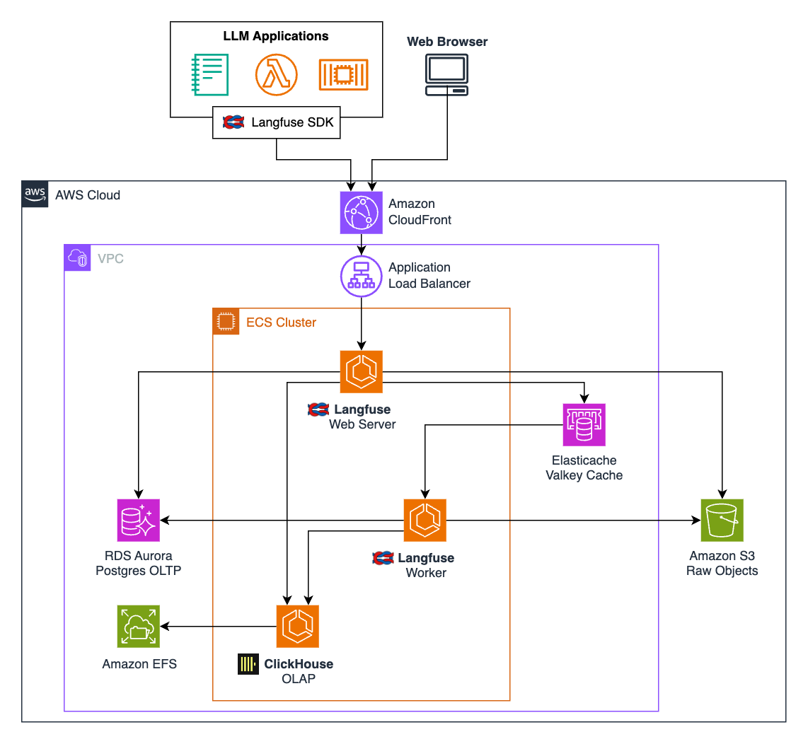

# Self-Host Langfuse on Amazon ECS with Fargate using TypeScript CDK

Langfuse is an Open Source LLM Engineering platform that helps teams collaboratively debug, analyze, and iterate on their LLM applications.

This repository demonstrates how to deploy a self-hosted Langfuse solution using AWS Fargate for Amazon ECS. It is designed for initial experimentation and does not include all features available in Langfuse Enterprise Edition. For production-ready deployments, check out the [Langfuse offerings through AWS Marketplace](https://aws.amazon.com/marketplace/seller-profile?id=seller-nmyz7ju7oafxu).

## Architecture overview

This deployment involves multiple AWS services to host Langfuse components as described in their [official documentation on self-hosting](https://langfuse.com/self-hosting#architecture). In this sample, shown also in the architecture diagram below, we use:

1. [AWS Fargate for Amazon ECS](https://docs.aws.amazon.com/AmazonECS/latest/developerguide/AWS_Fargate.html) to host the required containers without the need to manage servers or clusters of Amazon EC2 instances
2. [Amazon RDS](https://aws.amazon.com/rds/postgresql/) for the Postgres OLTP store
3. [Amazon Elasticache](https://aws.amazon.com/elasticache/) for the Valkey cache
4. [Amazon EFS](https://aws.amazon.com/efs/) for durable managed storage to back the deployed [ClickHouse](https://clickhouse.com/docs/intro) OLAP system
5. [Amazon CloudFront](https://docs.aws.amazon.com/AmazonCloudFront/latest/DeveloperGuide/Introduction.html) for high-performance CDN and HTTPS connectivity to the deployed Langfuse service.



## Deployment option 1: Quick start

If you don't have CDK development tooling set up already, and would just like to deploy the Langfuse architecture with the default settings - you can use the [AWS CloudFormation](https://docs.aws.amazon.com/AWSCloudFormation/latest/UserGuide/Welcome.html) template in [cfn_bootstrap.yml](./cfn_bootstrap.yml): Open the [CloudFormation Console](https://console.aws.amazon.com/cloudformation/home?#/stacks/create) in your target AWS Account and Region, click **Create stack**, and upload the template file.

This "bootstrap" stack sets up a CI project in [AWS CodeBuild](https://docs.aws.amazon.com/codebuild/latest/userguide/welcome.html) which pulls the sample code and performs the below app CDK setup steps for you automatically in the Cloud - with no local development environment required. ⚠️ **Note** though, that the CodeBuild project is granted *broad permissions* to deploy all the sample's AWS resources on your behalf - so is not recommended for use in production environments as-is.

## Deployment option 2: Developer setup (Suggested workflow)

If you are comfortable with CDK deployment or want to customize the app, you'll need to set up your local development environment rather than using the quick-start template above.

### Prerequisites:

1. Docker or Finch

    This project requires a local container build environment. If your organization doesn't support [Docker Desktop](https://www.docker.com/products/docker-desktop/), you can instead install [Finch](https://runfinch.com/). If using Finch instead of Docker, remember to:

    - Initialise the VM with `finch vm start`, and
    - Tell CDK how to build containers, by running `export CDK_DOCKER=finch` (on MacOS/Linux), or `SET CDK_DOCKER=finch` (on Windows)

2.  NodeJS

    This project requires [NodeJS](https://nodejs.org/) v20+

3.  AWS CLI login

    To actually deploy the infrastructure to a target AWS Account (and possibly, even to synthesize a concrete template), you'll need to [configure your AWS CLI credentials](https://docs.aws.amazon.com/cli/latest/userguide/cli-chap-configure.html). Note that whatever principal you log in to AWS with (User, Role, etc) will need the relevant *IAM Permissions* to deploy and manage all types of resources used by the sample - which is a broad set.

    You'll also want to set your target *AWS Region*. You can check your current active AWS Account by running `aws sts get-caller-identity`, and your selected region with `aws configure get region`.


### Development workflow

Once your development environment is set up, this sample works like a standard CDK app project.

First, install the project's dependencies:

```bash
npm install
```

Then, you can deploy it to AWS:

```bash
# Deploy or update all Stacks in the app:
# (Optionally specify --require-approval never to suppress approval prompts)
npx cdk deploy --all
```

To **delete** the deployed infrastructure when you're done exploring, and avoid ongoing charges:

> ⚠️ **Warning:** Running the below will irreversibly delete any data you've stored in your deployed Langfuse instance!

```bash
npx cdk destroy --all
```

**Other useful commands** for the project include:
- `npx cdk destroy` to delete the deployed infrastructure
- `npx cdk synth` to ["synthesize"](https://docs.aws.amazon.com/cdk/v2/guide/configure-synth.html) the CDK application to deployable CloudFormation template(s), without actually deploying
- `npx cdk list` to list all CDK stacks and their dependencies

Refer to the [CDK CLI commands guide](https://docs.aws.amazon.com/cdk/v2/guide/ref-cli-cmd.html) for a full reference


## License
This library is licensed under the MIT-0 License. See the LICENSE file.
