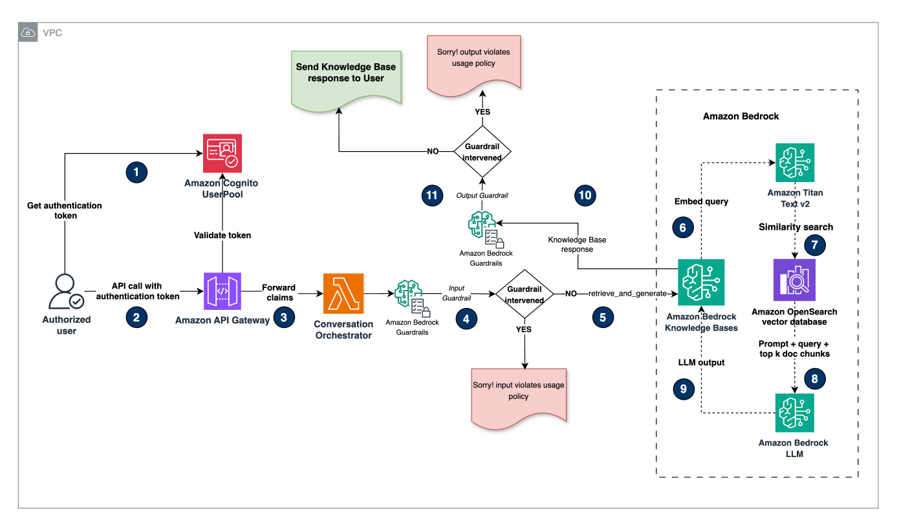

# Scenario 1 - Data identification and redaction before ingestion to Amazon Bedrock knowledge base


In Scenario 1, documents flow through a series of carefully orchestrated steps:

1. Initial Document Upload (Step 1):
    - Users upload source documents containing sensitive data to an S3 bucket's "_inputs/_" folder
    - This triggers an automated data identification and redaction pipeline
2. Comprehend PII Redaction Process (Step 2):
    - ComprehendLambda, triggered by an EventBridge rule every 5 minutes (configurable):
      - Scans for new files landing in the "_inputs/_" folder
      - Moves landed files in "_inputs/_" folder to "_processing/_" folder
      - Initiates an async _Comprehend PII redaction analysis job_
      - Records the job ID and status in a DynamoDB JobTracking table
    - Comprehend automatically redacts sensitive elements like:
      - Names, addresses, phone numbers
      - Social security numbers, driver's license IDs
      - Banking information and credit card details
      - Comprehend replaces identified PlI entities with placeholder tokens (e.g., [NAME], [SSN])
      - Once comprehend job completes, redacted files are moved to "_for_macie_scan/_" folder
3. Secondary Verification with Amazon Macie - Sensitive Data Detection (Step 3):
    - MacieLambda function monitors Comprehend job completion
    - Upon successful completion, triggers a Macie one-time sensitive data detection job
    - Macie sensitive data detection job scans files in the "_for_macie_scan/_" folder and generates findings with severity
    - Based on Macie findings:
       - Files with severity >= 3 (HIGH) move to "quarantine/" folder for human review
       - Files with severity < 3 (LOW) transfer to a "_redacted_" bucket (created during CDK app creation)
4. Amazon Bedrock knowledge base Integration (Step 4):
   - Amazon Bedrock knowledge base data ingestion job is triggered with files in the "_redacted_" bucket as the data source for ingestion
   - Amazon Bedrock Knowledge Base chunks, stores and indexes the documents securely to the Amazon OpenSearch vector store
   - Ready for use in RAG applications

## Augmented Retrieval Flow



---

## Usage

### Deploying CDK stack

Before running the next step:

- Ensure you have completed all steps listed in the [Pre-requisites](../README.md#pre-requisites) section of the main [README.md](../README.md) file.
- **IMPORTANT:** Ensure [`synthetic_data.py`](./synthetic_data.py) script is run before this step. Refer to [Synthetic Data Generation Tool](../README.md#synthetic-data-generation-tool) section for info on running this script.
- Ensure Amazon Macie is enabled. Refer to [getting-started](https://docs.aws.amazon.com/macie/latest/user/getting-started.html) guide for more info.
- Install Docker desktop for custom CDK constructs.
  - [Install Docker desktop for windows](https://docs.docker.com/desktop/setup/install/windows-install/)
  - [Install Docker desktop for Mac](https://docs.docker.com/desktop/setup/install/mac-install/)
  - [Install Docker desktop for Linux](https://docs.docker.com/desktop/setup/install/linux/)
- Ensure Docker desktop is up and running.

#### Run shell script to deploy CDK app

Execute the [`run_app.sh`](./run_app.sh) bash script by switching into `scenario_1/` directory.

>**IMPORTANT:** Script will pause execution and asks to set password for cognito user `jane@example.com`

```shell
cd scenario_1/
chmod +x run_app.sh
./run_app.sh
```

Wait for the script to complete.

>**IMPORTANT:** The script can take anywhere between 30-35 minutes for deploying the stack,triggering lambdas and monitoring Amazon Comprehend and Amazon Macie job completions.

Once the script completes successfully, it automatically launches the streamlit app at <http://localhost:8501/>

- Login using `jane@example.com` with password reset earlier.
- From the sidebar, select a model from the drop-down.
- Optionally, set model params like `temperature` and `top_p` values.
- Ask questions based on your data files in `../data/` folder.

Here are a few sample questions to use as prompts:

```text
- What medications were recommended for Chronic migraines
- Typically what are recommended medications for shortness of breath
- List all patients with Obesity as Symptom and the recommended medications
- What is the home address of Nikhil Jayashankar
- List all patients under Institution Flores Group Medical Center
```

>**NOTE:** The above prompts are examples that only use patient medical notes generated during the app setup.Your datafiles may or may not work with the exact prompts as the synthetic data generated is random. Ensure to check your datafiles in the `../data/` folder to customize your prompts.

>**IMPORTANT:** PII Detection Disclaimer: This solution demonstrates PII detection and redaction but is not exhaustive.Customers are responsible for implementing appropriate PII detection and redaction methods. The configured patterns are examples only and do not cover all possible PII variations. The regular expressions configured in Bedrock Guardrails within this solution serve as examples and do not cover all possible variations for detecting PII types. For instance, date of birth formats can vary widely. Ensure that you configure Bedrock Guardrails and policies to accurately detect the PII types relevant to your specific use case. Refer to [Bedrock Guardrails sensitive information filters](https://docs.aws.amazon.com/bedrock/latest/userguide/guardrails-sensitive-filters.html)

### Scenario1 Cleanup

Delete all cdk deployed resources.

>**NOTE:** The below command deletes all deployed resources including S3 buckets.

```shell
cd cdk
cdk destroy
```
