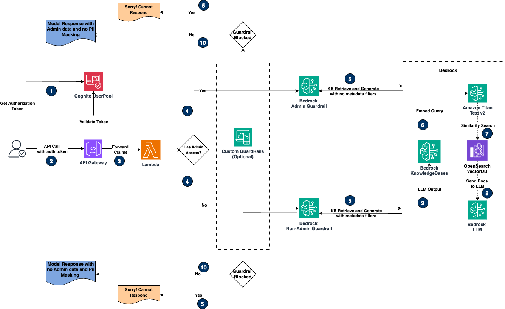

# Scenario 2 - Role-Based access to PII data during retrieval



## Architecture break-down

* Authentication Flow (Steps 1-3)
  * User initiates request by obtaining authorization token from Cognito User Pool
  * API call is made with authentication token to API Gateway
  * API Gateway forwards claims to AWS Lambda for processing
* Access Control Validation (Step 4)
  * System checks for admin access privileges
  * Request is routed to one of two paths based on user role:
    * Admin path: Uses admin-specific guardrails
    * Non-admin path: Implements stricter PII controls
* Knowledge Base Processing (Steps 5-8)
  * Query processing through Bedrock Knowledge Base includes:
    * Embedding generation using Amazon Titan
    * Similarity search via OpenSearch Vector DB
    * Application of metadata filters based on user role
  * Two distinct guardrail configurations process requests:
    * Admin Guardrail: Minimal PII restrictions
    * Non-Admin Guardrail: Enhanced PII protection
* Response Generation (Steps 9-10)
  * Bedrock LLM generates appropriate response
  * Guardrail validation check:
    * If blocked: Returns "Sorry! Cannot Respond" message
    * If passed: Returns role-appropriate response
      * Admin users receive full information
      * Non-admin users receive PII-masked information

---

## Usage

### Deploying CDK stack

Before running the next step:

* Ensure you have completed all steps listed in the [Pre-requisites](../README.md#pre-requisites) section of the main [README.md](../README.md) file.
* **IMPORTANT:** Ensure [`synthetic_data.py`](./synthetic_data.py) script is run before this step. Refer to [Synthetic Data Generation Tool](../README.md#synthetic-data-generation-tool) section for info.
* Install Docker desktop for custom CDK constructs.
  * [Install Docker desktop for windows](https://docs.docker.com/desktop/setup/install/windows-install/)
  * [Install Docker desktop for Mac](https://docs.docker.com/desktop/setup/install/mac-install/)
  * [Install Docker desktop for Linux](https://docs.docker.com/desktop/setup/install/linux/)
* Ensure Docker desktop is up and running.

#### Run shell script to deploy CDK app

Execute the [`run_app.sh`](./run_app.sh) bash script by switching into `scenario_2/` directory.

```shell
[ "${PWD##*/}" = "scenario_1" ] && cd ..
cd scenario_2/
chmod +x run_app.sh
./run_app.sh
```

Wait for the script to complete. After the script completes it should automatically launch the streamlit app at <http://localhost:8501/>

* Login using `jane@example.com` for Admin access or `john@example.com` for Non-Admin access with password reset earlier.
* From the sidebar, select a model from the drop-down.
* Optionally, set model params like `temperature` and `top_p` values.
* Ask questions based on your data files in `../data/` folder.

Here are a few sample questions:

```text
- List all patients with Obesity as Symptom and the recommended medications
- Which patients are currently taking Furosemide and Atorvastatin medications
- Generate a list of all patient names and a summary of their symptoms grouped by symptoms. Output in markdown table format.
- List all patients under Institution Flores Group Medical Center
- Tell me more about Mr. Smith and the reason PMD is needed (Will work for Admins only)
```

>**NOTE:** The above questions are just for reference your datafiles may or may not contain information on the questions. Check your datafiles in [data](../data/) folder.

>**IMPORTANT:** PII Detection Disclaimer: This solution demonstrates PII detection and redaction but is not exhaustive.Customers are responsible for implementing appropriate PII detection and redaction methods. The configured patterns are examples only and do not cover all possible PII variations. The regular expressions configured in Bedrock Guardrails within this solution serve as examples and do not cover all possible variations for detecting PII types. For instance, date of birth formats can vary widely. Ensure that you configure Bedrock Guardrails and policies to accurately detect the PII types relevant to your specific use case. Refer to [Bedrock Guardrails sensitive information filters](https://docs.aws.amazon.com/bedrock/latest/userguide/guardrails-sensitive-filters.html)

### Scenario 2 Cleanup

Delete all cdk deployed resources.

>**NOTE:** The below command deletes all deployed resources including S3 buckets.

```shell
cd cdk
cdk destroy
```
